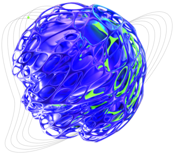
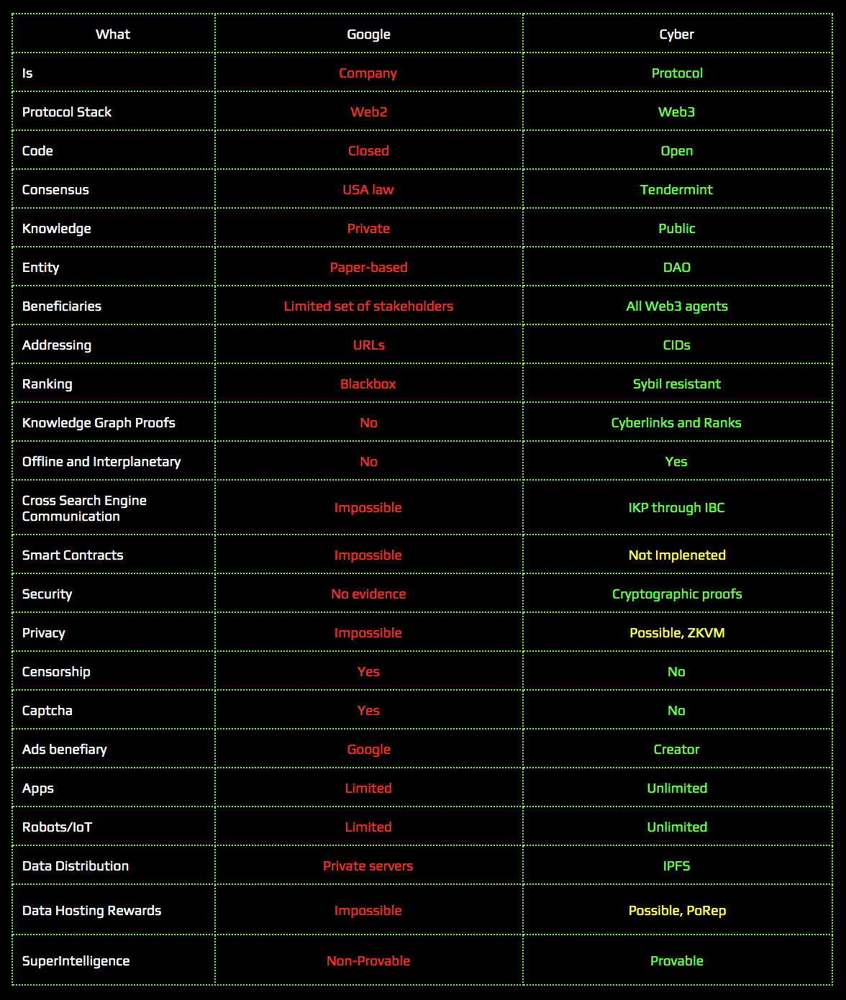
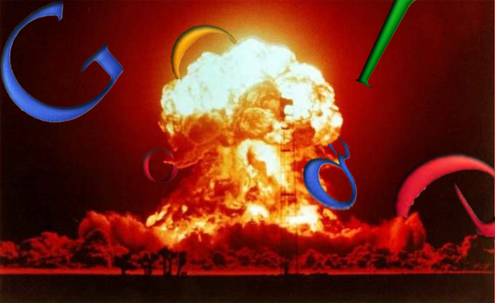

# Cyber - knowledge consensus supercomputer for The Great Web

<div align="center">
 
</div>

<div align="center">
 <h3>Try decentralized search engine - <a href="https://cyber.page">cyber.page</a></h1>
</div>

<div align="center">
 <h3>Whitepaper - <a href="https://ipfs.io/ipfs/QmQ1Vong13MDNxixDyUdjniqqEj8sjuNEBYMyhQU4gQgq3">cyber: Computing the knowledge of the Great Web</a></h1>
</div>

<div align="center">
 <h3><a href="https://github.com/cybercongress/congress/blob/master/ecosystem/ELI-5%20FAQ.md">ELI-5</a> and <a href="https://github.com/cybercongress/congress/blob/master/ecosystem/Cyber%20Homestead%20doc.md">Homestead Documentation</a></h1>
</div>

<div align="center">
 <h3>Onboarding <a href="https://github.com/cybercongress/congress/blob/master/ecosystem/validators/onboarding.md">point</a> for cyber validators</a></h1>
</div>

<div align="center">
 <h3><a href="https://t.me/fuckgoogle">#fuckgoogle</a> community</h1>
</div>

<div align="center">
 <h3><a href="https://ai.cybercongress.ai/">Forum</a> and <a href="https://cybercongress.ai/post/">Blog</a></h1>
</div>

_____________

### Code

[](https://github.com/cybercongress/cyberd/releases/latest)
[](https://circleci.com/gh/cybercongress/workflows/go-cyber/tree/master)
[](https://github.com/cybercongress/cyberd/blob/master/LICENSE)


[](https://github.com/cybercongress/cyberd)
[](https://github.com/cybercongress/cyberd/graphs/contributors)
[](https://coveralls.io/github/cybercongress/cyberd?branch=master)

### Blockchain

[](https://github.com/cybercongress/cyberd/blob/master/docs/run_validator.md)
[]()
[]()
[]()
[]()
[]()

### Community

[](https://t.me/fuckgoogle)
[](https://t.me/fuckgoogle)
[](https://ai.cybercongress.ai/)
[](https://twitter.com/@cyber_devs)
[](https://www.reddit.com/r/cybercongress)

_____________

## Why

Google is the most powerful religion ever, and now is the time to abandon it. 

The Great Web is coming.

A search system that will drive its growth, needs to be censorless, open and relevant.

<div align="center">
 
</div>

## What is Cyber

Cyber is a knowledge consensus computer for answers and a search engine. Cyber is defined by web3 agents. It is a distributed consensus supercomputer that runs on top of IPFS. It can compute relevance for web3 data via the use of cyberlinks, that are created from IPFS hashes. Essentialy, those hashes represent [Content IDentificators (CIDs)] ranked by cyber~Rank (token-weighted Page Rank):

```bash
CID1 -----> CID2
```

Cyberlinks are committed by Web3 agents. They are links between two CIDs. In its current implementation, a CID is an IPFS hash of CIDv0 or of CIDv1. A web3 agent can link a CID of any keyword, app, etc - with another CID. Then, the agent creates a link between the two hashes with a weight corresponding to a stake.

All the cyberlinks with a given weight are stored within the knowledge graph. The graph is re-computed by the validators every given number of blocks. For calculations, we've implemented `the proof of relevance` root-hash, which is computed from CIDs rank values (which are computed on GPUs with CUDA support every round). 

Cyber is the first implementation of the cyber protocol. It is based on [cosmos-SDK](https://github.com/cosmos/cosmos-sdk) and [tendermint BFT Consensus](https://github.com/tendermint/tendermint).

Network use bandwidth model to allow agents make transactions without fees. The main goal of the model is to reduce the daily networks growth to a given constant which adjustable with network governance.

Each message, of a transaction type - for example, a link or a send are assigned an given bandwidth cost. A agent bandwidth depends on their balance and is equal to the sum of their liquid and staked tokens. The agent bandwidth is a recoverable value. Full recovery time of the bandwidths, from zero to maximum value adjustable via network governance.

### For validators

Each validator participates in the Tendermint consensus and computes/validates cyber~Rank within the knowledge graph.

### For rank providers

Rank providers crawl/index the The Great Web. They then, cyberlinks CIDs of any given data to cyber by consuming their bandwidth with weight of their accounts.

### For search users

A valuable, censorship-resistant and a provable search of the The Great Web for any kind of intellegent species.

### For developers

The chance to create a new and a `Decentralized Google` with affiliated services, for example: marketplaces, crawlers, web indexers, decentralized platforms and so on. You have the chance of buidl The Great Web.

### For data/content producers

The opportunity to move their content to web3 and save it from any type of censorship. Your content is yours. Make sure others will be able to see it.

### For miners / GPUs holders

With the growth of the network, we will need cards, a lot of cards. Join us.

_____________

## Cyber Protocol

In its core the protocol is very minimalistic and can be eli5's-expressed by the following steps:

1. Compute the genesis of cyber protocol based on the distribution games
2. Define the state of the knowledge graph
3. Gather transactions, using consensus computer
4. Check the validity of the signatures
5. Check the bandwidth limit
6. Check the validity of CIDv0/CIDv1
7. If the signatures, the bandwidth limit and CIDv1 are all valid - apply cyberlinks and transactions
8. Calculate cyber~Rank values every round for the CIDs on the knowledge graph

_____________

## Validation

- [Onboarding point for cyber validators](https://github.com/cybercongress/congress/blob/master/ecosystem/validators/onboarding.md)
- [Run the validator](./docs/run_validator.md)

## Status

Explore our [network](https://cyber.page/brain) and participate in [Game of Links](https://cyber.page/gol)

## Documentation and guides

Explore the documentation in our [knowledge base](https://cybercongress.ai/docs/cyberd/cyberd/).

- Guides:
  - [ELI-5](https://github.com/cybercongress/congress/blob/master/ecosystem/ELI-5%20FAQ.md)
  - [Cyber Homestead](https://github.com/cybercongress/congress/blob/master/ecosystem/Cyber%20Homestead%20doc.md)
  - [cyber~Ecosystem development](https://github.com/cybercongress/congress/blob/master/ecosystem/cyber~Ecosystem%20development%20paper.md)
  - [Usecases](https://github.com/cybercongress/congress/blob/master/ecosystem/usecases.md)
- Launch:
  - [Launch protocol](https://github.com/cybercongress/launch-kit/blob/0.1.0/README.md#distribution-params)
  - [Genesis parameters](https://github.com/cybercongress/launch-kit/blob/0.1.0/params/README.md)
- Usage:
  - [CLI guide](./docs/ultimate-commands-guide.md)
  - [Get EUL](https://cyber.page/tot)
  - [Cyber Ledger guide](./docs/cyberd_Ledger_guide.md)
  - [Multisig guide](./docs/multisig_guide.md)
- Validators:
  - [Supported GPUs list](./docs/supported_gpu_list.md)
  - [Port forwarding](./docs/port_forwarding_guide.md)
  - [Run validator with Tendermint KMS and Ledger](./docs/validator_launch_with_tendermintKMS_and_ledger.md)
  - [Set up config.toml in the right way](./docs/setup_cyberd_configuration.md)
- Development environment:
  - [Setup development environment](./docs/setup_dev_env.md)
- Specs:
  - [RPC](./docs/rpc.md)
  - [Keystore](./docs/keystore.md)
- Gifts to Ethereum, Cosmos and Urbit communities:
  - [Gift Information and FAQ](https://github.com/cybercongress/congress/blob/master/ecosystem/Gift%20FAQ%20and%20general%20gift%20information.md)
- [CHANGELOG](./CHANGELOG.md)
- [CONTRIBUTING](./CONTRIBUTING.md)

_____________

## Community

**\>** [#fuckgoogle community](https://t.me/fuckgoogle) for The Great Web agents

**\>** [Twitter](https://twitter.com/cyber_devs) for updates and news

**\>** [Own blog](https://cybercongress.ai/post/) with RSS and useful articles

**\>** [Forum](https://ai.cybercongress.ai/) of Cyber community


## Let's #fuckgoogle together

### Issues

If you have any problems with, or questions, about search - please contact us via
a [GitHub issue](https://github.com/cybercongress/cyberd/issues).

### Contribute

You are invited to contribute new features, fixes, or updates - large or small. We are always thrilled to receive pull requests and do our best to process them as fast as we can. You can find detailed information in our
[contribution guide](./CONTRIBUTING.md).

### Gitcoin program

We want to reward you for your contributions! We constantly fund our issues on [gitcoin](https://gitcoin.co/profile/cybercongress) and attach good descriptions to them. Along with the current state of the project  and with user stories. We answer comments regularly in issues and in our [#fuckgoogle chat](https://t.me/fuckgoogle).

<a href="https://gitcoin.co/explorer?q=cyberd">
 
</a>

## Changelog

Stay tuned with our [Changelog](./CHANGELOG.md).

## Team
<table>
  <tr>
    <td align="center"><a href=https://github.com/xhipster><br /><sub><b>Dima Starodubcev</b></sub></a><br /><a href="https://github.com/cybercongress/cyberd/commits?author=xhipster" title="Documentation">📖</a> <a href="#maintenance-xhipster" title="Maintenance">🚧</a></td><td align="center"><a href="https://github.com/litvintech"><br /><sub><b>Valery Litvin</b></sub></a><br /><a href="https://github.com/cybercongress/cyberd/commits?author=litvintech" title="Code">💻</a> <a href="#projectManagement-litvintech" title="Project Management">📆</a> <a href="https://github.com/cybercongress/cyberd/commits?author=litvintech" title="Documentation">📖</a></td><td align="center"><a href="https://github.com/SaveTheAles"><br /><sub><b>Ales Puchilo</b></sub></a><br /><a href="https://github.com/cybercongress/cyberd/commits?author=SaveTheAles" title="Documentation">📖</a></td>
    <td align="center"><a href="https://github.com/mrlp4"><br /><sub><b>Kiryl Laptanovich</b></sub></a><br /><a href="https://github.com/cybercongress/cyberd/commits?author=mrlp4" title="Tests">⚠️</a></td>
   <td align="center"><a href="https://github.com/serejandmyself"><br /><sub><b>Sergey Simanovsky</b></sub></a><br /><a href="https://github.com/cybercongress/cyberd/commits?author=serejandmyself" title="Ecosystem">:milky_way:</a></td>
  </tr>
</table>

## License

Cyber License - Don’t believe, don’t fear, don’t ask.

We will be happy if you fork and launch your own network and set up a knowledge graph. Eventually, we will meet each other somewhere in the metaverse (with the help of IBC, of course).

## The End of Google

<div align="center">
 
</div>

<div align="center">
 <sub>Built by
 <a href="https://twitter.com/cyber_devs">cyber~Congress</a> and
 <a href="https://github.com/cybercongress/cyberd/graphs/contributors">contributors</a>
</div>
