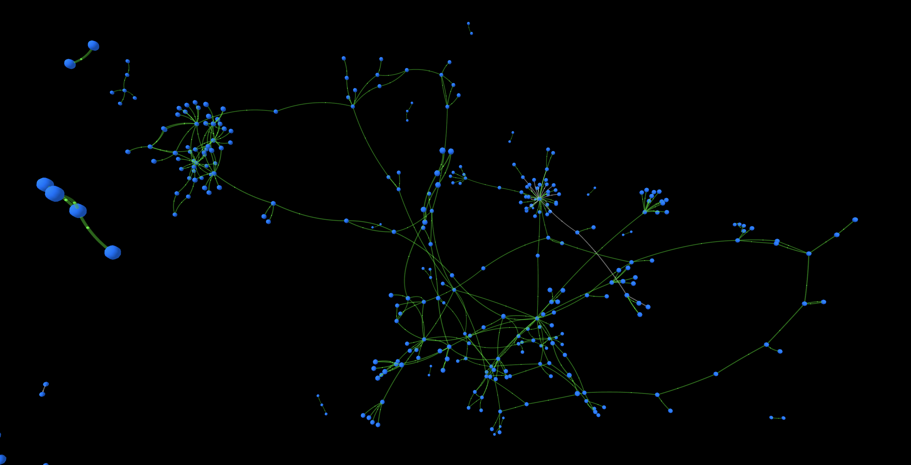

# Cyber - SuperIntelligence for The Great Web

<div align="center">
 
</div>

<div align="center">
 <h3>Start to use right now - <a href="https://cyb.ai">cyb.ai</a></h3>
</div>

<div align="center">
 <h3>Whitepaper - <a href="https://ipfs.io/ipfs/QmQ1Vong13MDNxixDyUdjniqqEj8sjuNEBYMyhQU4gQgq3">cyber: Computing the knowledge of the Great Web</a></h3>
</div>

<div align="center">
 <h3><a href="https://github.com/cybercongress/congress/blob/master/ecosystem/ELI-5%20FAQ.md">ELI-5</a> and <a href="https://github.com/cybercongress/congress/blob/master/ecosystem/Cyber%20Homestead%20doc.md">Homestead Documentation</a></h3>
</div>

<div align="center">
 <h3>Onboarding <a href="https://github.com/cybercongress/congress/blob/master/ecosystem/validators/onboarding.md">point</a> for cyber validators</a> and <a href="https://github.com/cybercongress/go-cyber/blob/bostrom-dev/docs/run_validator.md">Setup validator guide</a></h3>
</div>

<div align="center">
 <h3><a href="https://t.me/fuckgoogle">#fuckgoogle</a> and <a href="https://t.me/cyber_russian_community">cyber~Russian</a> communities </h3>
</div>

<div align="center">
 <h3><a href="">Gitcoin</a> and <a href="https://cybercongress.ai/post/">Blog</a></h3>
</div>

<div align="center">
 <h3>Network <a href="https://monitor.cybernode.ai/">monitor</a></h3>
</div>

<div align="center">
 <h3><b>go-cyber is golang implementation of cyber <a href="https://github.com/cybercongress/cyber">protocol</a></b></h3>
</div>

_____________

## Code

[](https://github.com/cybercongress/cyberd/releases/latest)
[](https://circleci.com/gh/cybercongress/workflows/go-cyber/tree/master)
[](https://github.com/cybercongress/cyberd/blob/master/LICENSE)


[](https://github.com/cybercongress/cyberd)
[](https://github.com/cybercongress/cyberd/graphs/contributors)
[](https://coveralls.io/github/cybercongress/cyberd?branch=master)

## Blockchain

[](https://github.com/cybercongress/cyberd/blob/master/docs/run_validator.md)
[]()
[]()
[]()
[]()
[]()
_________________________________________________________

## Networks
|Network|Cosmos|Order|Launch|Security Token| Resources Token|Bandwidth Token| Power Token | Supported Tokens |
|---|---|---|---|---|---|---|---|---|
|Bostrom|🟢|Canary|2021|BOOT |HYDROGEN|VOLT|AMPER|[ICS20, CW20, CW721, CW1155]|
|Cyber|🔵|Mainnet|2022|CYB|HYDROGEN|VOLT|AMPER|[ICS20, CW20, CW721, CW1155]|
_________________________________________________________

## Computer Specification 🛠

1. Universe - [Cosmos]()
2. Consensus - [Tendermint]() | BOOT
3. External Communication - [IBC]()
4. Liquidity - [AMM]()
5. Governance - [Ideas](), [Upgrades](), [Parameters](),  [Fund]() | BOOT
6. Resources Mining - [Liquid Staking]() | BOOT -> HYDROGEN
7. Resources Creation - [Investmint]() | HYDROGEN -> VOLT / AMPER
8. Brain - [Knowledge Graph]()
9. Particles addressing - IPFS [CID]()
10. Particles connecting - [cyberlinks]()
11. Cyberlinking - [Bandwidth model]() | VOLT
12. Graph Program - [Token Weighted Page Rank]() | AMPER
13. Graph Program - [Token Weighted -Entropy]() | AMPER
14. Graph Processing - [GPU]()
15. Energy Grid - [Energy Router]() | VOLT & AMPER
16. Virtual Machine - [CosmWasm]() | BOOT
17. Programs Bus - [Interconnect Line]()
18. Autonomous Programs - [Cron]() | BOOT
19. Programs Income - [execution fees]() | BOOT
20. API - [Graph]() and [General]()
21. Client Library - [cyber-js]() & [cyber-py]()
22. Indexer - [cyberindex]()
23. Launch documentation - [launch-kit]()
24. Versioning - [Kelvin]()
25. License - [Cyber License]()
26. Future Cyber VM support - [GraphBLAS R&D]()

**Try [cyb.ai](https://cyb.ai) on bostrom-testnet-4 network**
_________________________________________________________

## ELI-5


_________________________________________________________

## Setup

Chain-ID: bostrom-testnet-5

Genesis: [QmPtHR1ee3s4PsSqHqpfQv68raHgk2W4XV9uvnUgnLkMSP](http://cloudflare-ipfs.com/ipfs/QmPtHR1ee3s4PsSqHqpfQv68raHgk2W4XV9uvnUgnLkMSP)

Build: ```make install```

Run: ```cyber start ```

```
To use as CLI with remote node just set CUDA_ENABLED=false in Makefile and build
```

- Version - v0.2.0-beta7
- [RPC](https://rpc.bostromdev.cybernode.ai/)
- [REST](https://lcd.bostromdev.cybernode.ai/rank/search?cid=QmdVWtX17m7UvF8FcvNLTJxcpxv2fSJd7Z3VBoYxxW9Qpu)
- Faucet: ```
  curl --header "Content-Type: application/json" --request POST --data '{"denom":"boot","address":"bostrom1sm9sq4wnn62tk5yz0x3fvvx2ea9efguqwvdu64"}' http://titan.cybernode.ai:8000/credit```
- Seed: `d0518ce9881a4b0c5872e5e9b7c4ea8d760dad3f@85.10.207.173:26656`
- Peers: `5d542c0eb40ae48dc2cac0c140aedb605ded77dc@195.201.105.229:26656,a7226dce9f543a4ecd8db1da2ffd7be05d40d3ad@185.186.208.36:26656,c72de1e20beed51b779d89b1cf08d8146016eec4@185.186.208.37:26656,4c130ed1c58f6d6be981c59a748511e581969c51@93.180.175.201:36656`

For better network stability please update your `.cyber/config/config.toml` lines as following: 

```
addr_book_strict = false

persistent_peers_max_dial_period = "300s"

allow_duplicate_ip = true
```
_________________________________________________________

## How to update from bostrom-testnet-4 to bostrom-testnet-5

If you have your bostrom-testnet-4 node running on our docker container do:

```bash
docker stop bostrom-testnet-4
docker rm bostrom-testnet-4
docker rmi cyberd/cyber:bostrom-testnet-4.2
docker run -d --gpus all --name=bostrom-testnet-5 --restart always -p 26656:26656 -p 26657:26657 -p 1317:1317 -e ALLOW_SEARCH=false -v $HOME/.cyber:/root/.cyber  cyberd/cyber:bostrom-testnet-5
```
This will pull new image and replace genesis and cyber binary to correct versions.

Than you'll have to send create-validator [transaction](https://github.com/cybercongress/go-cyber/blob/bostrom-dev/docs/run_validator.md#send-the-create-validator-transaction)
_________________________________________________________

## IBC

### Config for [Relayer](https://github.com/cosmos/relayer/)
```
{"key":"agent","chain-id":"bostrom-testnet-5","rpc-addr":"http://167.172.103.118:26657","account-prefix":"bostrom","gas-adjustment":1.5,"gas-prices":"0.01boot","trusting-period":"72h"}
```
_________________________________________________________

### Basic operations

### Follow hero and get HYDROGEN:
```
cyber tx staking delegate bostromvaloper1hmkqhy8ygl6tnl5g8tc503rwrmmrkjcqf92r73 100000000boot --from <name> --chain-id bostrom-testnet-5 --gas 150000 --gas-prices 0.01boot --yes --node https://rpc.bostromdev.cybernode.ai:443   
```

### Investmint HYDROGEN to get resources:
```
cyber tx resources investmint 75000000hydrogen millivolt 86400 --from <name> --chain-id bostrom-testnet-5--gas 160000 --gas-prices 0.01boot --yes --node https://rpc.bostromdev.cybernode.ai:443

cyber tx resources investmint 25000000hydrogen milliampere 86400 --from <name> --chain-id bostrom-testnet-5 --gas 160000 --gas-prices 0.01boot --yes --node https://rpc.bostromdev.cybernode.ai:443
```

### Cyberlink and Explore:
```
cyber tx graph cyberlink QmdVWtX17m7UvF8FcvNLTJxcpxv2fSJd7Z3VBoYxxW9Qpu Qmb9xPYYwHt1F3bQysKCZzXRzAT8QLvAyMe5DyPy4rene8 --from <name> --chain-id bostrom-testnet-5 --yes --node https://rpc.bostromdev.cybernode.ai:443

curl http://167.172.103.118:1317/rank/search?cid=QmdVWtX17m7UvF8FcvNLTJxcpxv2fSJd7Z3VBoYxxW9Qpu
```
_________________________________________________________

## Connect:
- [Cyber English Community](https://t.me/fuckgoogle)
- [Cyber Russian Community](https://t.me/cyber_russian_community)

_________________________________________________________

## Cyber vs Corps

| What                               | Google                      | Cyber                     |
|------------------------------------|-----------------------------|---------------------------|
| Is                                 | Company                     | Protocol                  |
| Protocol Stack                     | Web2                        | Web3                      |
| Code                               | Closed                      | Open                      |
| Consensus                          | USA law                     | Tendermint, Hybrid (2023) |
| Knowledge                          | Private                     | Public                    |
| Links                              | Hyperlinks                  | Cyberlinks                |
| Backlinks                          | No                          | Yes                       |
| Decentralized Marketing (DeMa)     | No                          | Yes                       |
| Beneficiaries                      | Limited set of stakeholders | Any web3 agent            |
| Addressing                         | URLs                        | CIDs                      |
| Ranking                            | Blackbox                    | Sybil resistant           |
| Knowledge Graph Proofs             | No                          | Cyberlinks and Ranks      |
| Offline and Interplanetary         | No                          | Yes                       |
| Internet Knowledge Protocol        | No                          | Over IBC (2022)           |
| Smart Contracts                    | Impossible                  | WASM                      |
| Smart Contracts on Knowledge Graph | No                          | Yes                       |
| GPU Smart Contracts                | No                          | GraphBLAS (2023)          |
| Software 2.0                       | No                          | Yes                       |
| Security                           | No evidence                 | Cryptographic proofs      |
| Privacy                            | Impossible                  | Possible (2025)           |
| Censorship                         | Yes                         | No                        |
| Captcha                            | Yes                         | No                        |
| Ads beneficiary                    | Google                      | Creator                   |
| Apps                               | Limited                     | Unlimited                 |
| Robots/IoT                         | Limited                     | Unlimited                 |
| Data Distribution                  | Private servers             | IPFS                      |
| Storage guaranty                   | Impossible                  | PoRep (2024)              |
| SuperIntelligence                  | Non-Provalbe                | Provable                  |
| Browser                            | Chrome                      | Cyb                       |
_________________________________________________________

## Cyber vs Govs

| What              | Your Gov        | Cyber        |
|-------------------|-----------------|--------------|
| Borders           | Yes             | No           |
| Customs           | Yes             | No           |
| Army              | Yes             | No           |
| Police            | Yes             | No           |
| Laws              | Paper           | Code         |
| Contracts         | Paper           | Code         |
| Censorship        | Yes             | No           |
| Children          | Their           | Yours        |
| Taxes             | Compulsory      | Voluntary    |
| Tax reporting     | Manual          | Automated    |
| Transaction tax   | 50%             | ~0.1%        |
| Printing tax      | 100%            | ~1%          |
| Provable voting   | No              | Yes          |
| Consensus         | Democracy       | Tendermint   |
| Currency          | Enforced        | Any          |
| Security          | Police & Army   | Cryptography |
| Decision makers   | They            | Us           |
| Privacy           | No              | Respect      |
| Brainwashing      | Yes             | No           |
| Antropocentrism   | Yes             | No           |
_________________________________________________________
