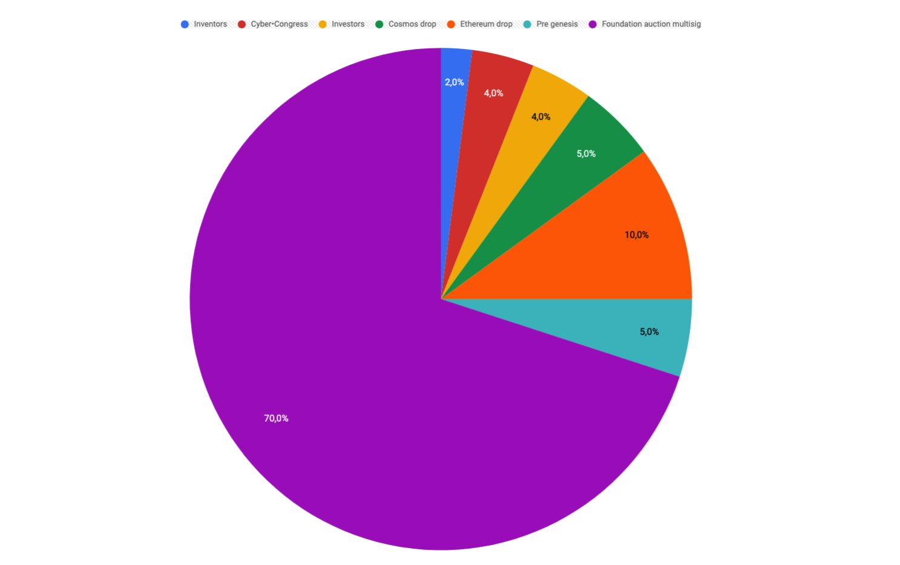
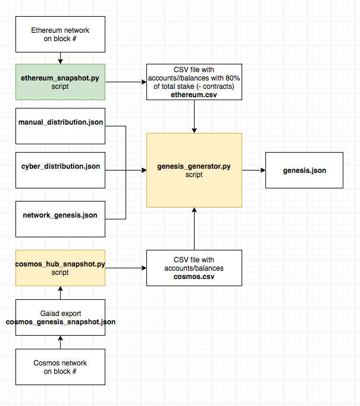
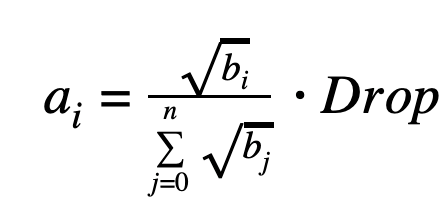

# Euler-5 genesis creation

`Euler-5` testnet will launch soon and this is a good opportunity to practice and testing genesis distribution model. According to our agreement, we build clear and transparency tools for the community. That's why we decide to make genesis creation process reproducible, so each can generate genesis file and compare it with ours (Spoiler: two files should be the same). During this article, you will understand the distribution basics and get the genesis creation process in details.

## Few words about the distribution

The genesis of `Euler-5` will contains 1 000 000 000 000 000 CYB or One Quadrillion CYB. This pie is be spread a number of participating groups as like:
 - Inventors. 2% for a good idea!
 - Cyber•Congress. 4% of motivation for cyber•Congress members and team.
 - Investors. 4% fo the great support in a hard time!
 - Cosmos drop. 5% for all available cosmos addresses as a drop.
 - Ethereum drop. 10% for the top 80% ETH addresses excluding contracts and addresses without at least one send transaction. 
 - Pre-genesis round. 5% for new investors. 
 - Foundation auction multisig. 70% for the economic game in Euler-5 and for auction.  

 

 Almost all of these groups insert manually except Cosmos and Ethereum drops and this part is the most interesting. 

## General schema of the genesis creation

In general, we need to collect N files and compile them to `genesis.json`. The `network_genesis.json` is a template of genesis with starter parameters and without accounts. The `manual_distribution.json` contains addresses of `inventors`, `cyber•Congress`, `investors`, `pre-genesis round`  and `foundation and auction` distribution groups. It's filled manually. The `cyber_distribution.json` file contains distribution percentages between groups. All we have to do is collect and convert ETH and Cosmos address with balances for adding them to `genesis` file. The question is how to do that. 



With Cosmos addresses is not a big problem. All we have to do is make a snapshot on the N block and collect addresses with special tool and `gaia` fullnode. After that, we need to convert `cosmos` addresses to `cyber`. It's the same bech32 coder, so the tool must get pubkeys of existing `cosmos` accounts and calculate new addresses with `cyber` prefix with the same balances. Now it's ready for including to genesis compiler. 

Ethereum drop is a little bit complex. We decide to exclude contract addresses, addresses with no at least one send transaction and also, the existing pool of ETH addresses we want to multiply by `0,997` coefficient. We've got it empirically, so the lowest address balances are approximately `0.2 ETH`. As result, we have no-contracts ETH addresses from ~0.2 ETH from wich at least one external transaction for drop. For that we can use ready-to-use ETH accounts index, google bigquery and our tool for collecting addresses with balances. There is a little problem to convert `ETH` addresses to `cyber`. Finally, we need database of `ETH` pubkeys from parity node to decode `ETH` addressess and encode pubkeys to `cyber` addresses with same `ETH` balances and get `.csv` file ready to genesis.

All of the above files will compile by `genesis_generator.py` in `genesis.json`.

This script will insert all manual distribution addresses, split shares between groups and recalculate `Cosmos` and `Ethereum` balances by the following formula:



where **a[i]** is balance of `cyber` address, **b[i]** balance of `cosmos` or `eth` address and balances sum of square roots in the denominator. **Drop** is allocated a percent of the total supply. 

## DIY

**Prepare your environment**. You need **Go 1.11+**, **python3** and **pip3** preinstalled. Also, you need google console account with oakth pub/priv keys pair for [bigquery](https://medium.com/google-cloud/how-to-query-balances-for-all-ethereum-addresses-in-bigquery-fb594e4034a7) add your google private key at `google-big-query-key.json`. And finally, you need synced **parity** and **gaiad** nodes. For your comfort, you can use `Sublime text` for large `CSV` files reading.

**Clone necessary tools**
```bash
git clone https://github.com/belya/cyberd-balances
git clone https://github.com/cybercongress/cosmos-address-tool
```

`cyberd-balances` is `python` scripts for queryng accounts and genesis creating. 
`cosmos-address-tool` is `go` tool for pubkeys decoding.

Go to `cyberd-balances` repo at your computer.

**Install requirements**

```bash
pip3 install -r ./requirements.txt
```

**Get еру pool of ETH addresses with balances.** Run:
```bash
python3 ./src/ethereum_snapshot.py --block ACTUAL_BLOCK
```
This script takes the state of `ETH` accounts from `bigquery` and return `CSV` file of accounts with balances at `./data/ethereum_genesis_snapshot.csv`.

**Go to `cosmos-address-tool` at your computer and build it**:

```bash
go build -o cosmos-address-tool ./
```

**Convert ETH accounts to cyber.** Move `ethereum_genesis_snapshot.csv` to `cosmos-address-tool` at your computer. Also, move `eth-pubkeys` from parity to `cosmos-address-tool`. Run:

```bash
./cosmos-address-tool convert-ethereum-batch ./ethereum_genesis_snapshot.csv eth-pubkeys --acc-prefix="cyber"
```

This script should decode `ETH` addresses to `cyber` and return `CSV` file `ethereum.csv` with a list of `cyber` accounts with `ETH` balances.

Ethereum drop list is prepared.

**Get `Cosmos` snapshot.** Go back to `cyberd-balances` and run:

```bash
get snapshot
```
get `snapshot.json`

Now we need to bring it to address/balances look by:

```bash
python3 ./src/cosmos_hub_snapshot.py
```

This script should return `CSV` file at `./data/cosmos_genesis_snapshot.csv` 

**Convert cosmos accounts to cyber.** Move `cosmos_genesis_snapshot.csv` to `cosmos-address-tool` and go to `cosmos-address-tool`. Now run:

```bash
cosmos-address-tool convert-cosmos-batch ./cosmos-hub.csv --acc-prefix="cyber"
```

This script should decode `cosmos` addresses to `cyber` and return `CSV` file `cosmos.csv` with a list of `cyber` accounts with `cosmos` balances.

Cosmos drop list is prepared.

**Last preparation**

Move `ethereum.csv` and `cosmos.csv` to `cyberd-balances/data`. Run:

```bash
python3 ./src/genesis_generator.py
```

It should return `genesis.json` file. Congratulations! 

Now you can compare this file with ours by to following methods:

1. If you have your own IPFS node you can calculate hash of `genesis.json` and compare it with our hash
2. Otherwise, you can use bash command: 

```bash
awk -F',' 'FNR==NR{a[$1];next};!($1 in a)' <genesis1.json> <genesis2.json>
```

If files the same you successfully reproduce genesis!