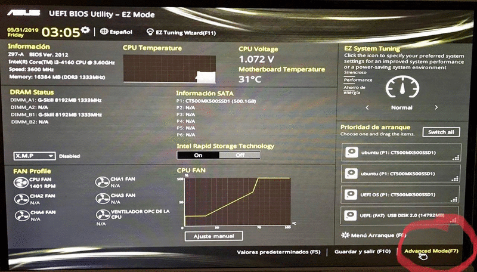

# Possible issue during drivers install

In an installation from 0 we can find an error that forces us to restart and modify some parts
in [BIOS](https://en.wikipedia.org/wiki/BIOS), I put the necessary steps here.

> In this case the motherboard is an [Asus Z-97A](https://www.asus.com/Motherboards/Z97A/),
but will be similar in others motherboards.

## Steps to follow

1. Go to BIOS by pressing the key for it (usually `F10` or `DEL`)

2. Go to Advanced Mode (`F7`)

3. Go to `Secure Boot`

4. In `OS Type` change `Windows UEFI mode` to `Other OS`

5. Save and restart

