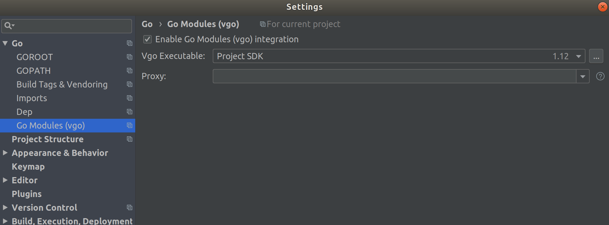
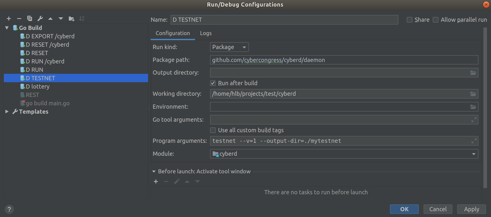
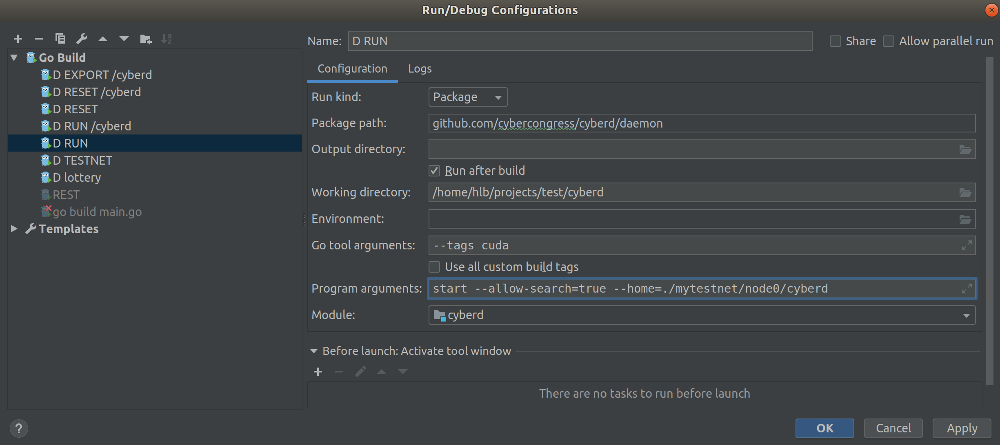
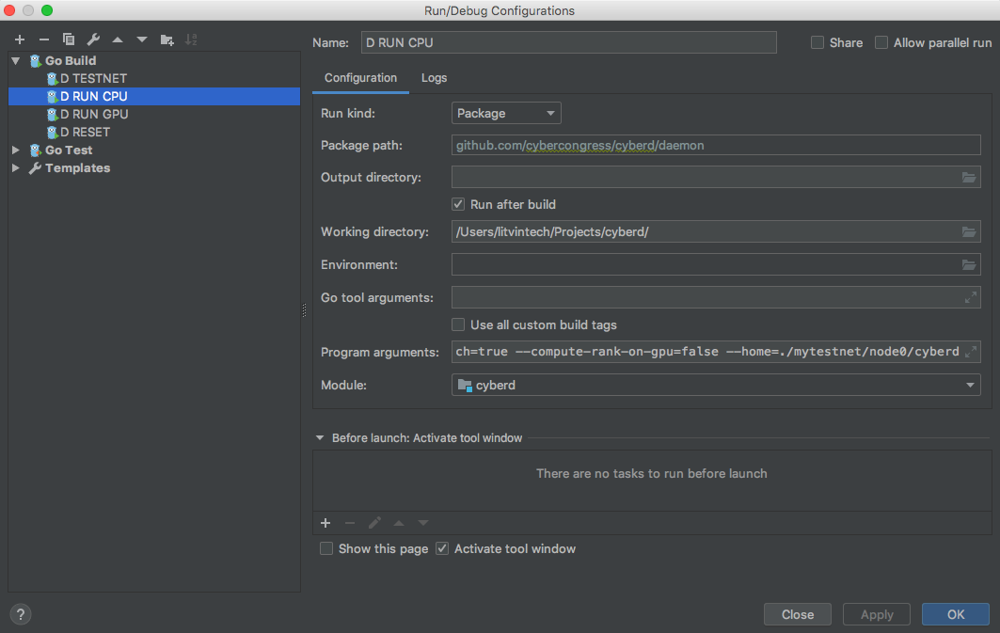
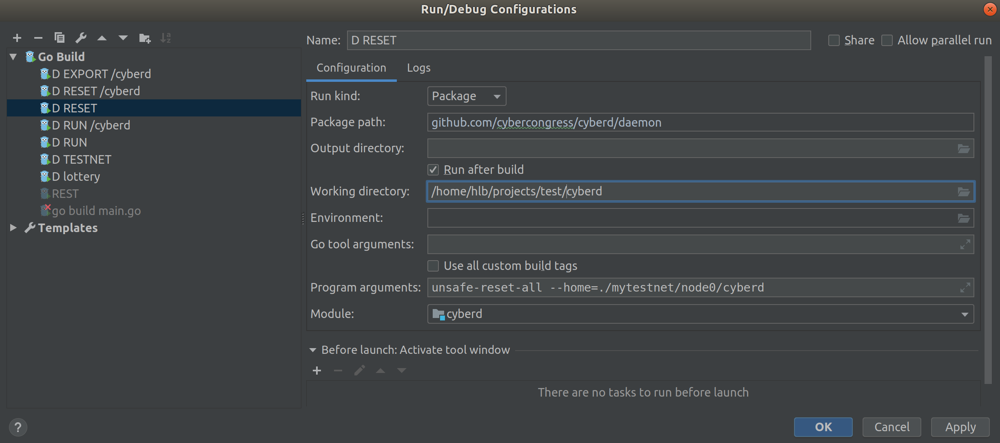

# Setup development environment

## Prestart
* Install [Golang 1.11+](https://golang.org/doc/install)
* Install [GoLand IDE](https://www.jetbrains.com/go/)

## Import project to GoLand
Open Project in GoLand by selecting: Open Project -> selecting cloned repository root folder


Enable **go mod** package management

Wait for dependency downloading and indexation

## Add Run Configurations
###Add testnet configuration


### Add run configuration with GPU


#### Notes about GPU dev environment

### Add run configuration with CPU


### Add reset configuration


## Running Node
### Generate testnet
Before node running, setup testnet with run configuration **D TESTNET**. 
- Folder **/mytestnet** will be added to the project root.
- In **/node0** subfolder you can find daemon and cli folders.
- Daemon folder will contain validator node data.
- In **/cyberdcli** folder you can find initial validator seed.

```
mytestnet
├── gentxs
│   └── node0.json
└── node0
    ├── cyberd
    │   ├── config
    │   │   ├── config.toml
    │   │   ├── genesis.json
    │   │   ├── node_key.json
    │   │   └── priv_validator_key.json
    │   └── data
    │       ├── priv_validator_state.json
    └── cyberdcli
        └── key_seed.json
```

### Run with GPU or CPU
After, just run **RUN** node configuration.


```
I[2019-05-15|15:06:56.735] Starting ABCI with Tendermint                module=main 
I[2019-05-15|15:06:56.789] Loading mem state                            module=main 
I[2019-05-15|15:06:56.789] App loaded                                   module=main time=118.743µs
I[2019-05-15|15:06:56.793] Search index loaded!                         module=main time=3.416449ms
I[2019-05-15|15:06:56.793] Search index starting listen new links       module=main 
I[2019-05-15|15:06:56.793] Search index starting listen new rank        module=main 
I[2019-05-15|15:06:56.910] Applying genesis                             module=main 
I[2019-05-15|15:06:56.914] File with links not found. Empty set will be used module=main 
I[2019-05-15|15:06:56.914] Genesis applied                              module=main time=3.420262ms
E[2019-05-15|15:06:56.947] Couldn't connect to any seeds                module=p2p 
I[2019-05-15|15:07:02.014] Executed block                               module=state height=1 validTxs=0 invalidTxs=0
I[2019-05-15|15:07:02.014] Rank calculated                              module=main time=2.069µs links=0 cids=0 hash=e3b0c44298fc1c149afbf4c8996fb92427ae41e4649b934ca495991b7852b855
I[2019-05-15|15:07:02.047] Committed state                              module=state height=1 txs=0 appHash=E3B0C44298FC1C149AFBF4C8996FB92427AE41E4649B934CA495991B7852B855
I[2019-05-15|15:07:07.078] Executed block                               module=state height=2 validTxs=0 invalidTxs=0
I[2019-05-15|15:07:07.107] Committed state                              module=state height=2 txs=0 appHash=E3B0C44298FC1C149AFBF4C8996FB92427AE41E4649B934CA495991B7852B855
I[2019-05-15|15:07:12.113] Executed block                               module=state height=3 validTxs=0 invalidTxs=0
I[2019-05-15|15:07:12.144] Committed state                              module=state height=3 txs=0 appHash=E3B0C44298FC1C149AFBF4C8996FB92427AE41E4649B934CA495991B7852B855
I[2019-05-15|15:07:17.168] Executed block                               module=state height=4 validTxs=0 invalidTxs=0
I[2019-05-15|15:07:17.207] Committed state                              module=state height=4 txs=0 appHash=E3B0C44298FC1C149AFBF4C8996FB92427AE41E4649B934CA495991B7852B855
```

### You may stop, and RUN again
```
I[2019-05-15|14:48:58.191] Starting ABCI with Tendermint                module=main 
I[2019-05-15|14:48:58.343] Loading mem state                            module=main 
I[2019-05-15|14:48:58.344] App loaded                                   module=main time=929.472µs
I[2019-05-15|14:48:58.399] Search index loaded!                         module=main time=16.928556ms
I[2019-05-15|14:48:58.399] Search index starting listen new links       module=main 
I[2019-05-15|14:48:58.399] Search index starting listen new rank        module=main 
E[2019-05-15|14:48:58.638] Couldn't connect to any seeds                module=p2p 
I[2019-05-15|14:49:03.716] Executed block                               module=state height=2032 validTxs=0 invalidTxs=0
I[2019-05-15|14:49:03.755] Committed state                              module=state height=2032 txs=0 appHash=1BAA91AD6FD9742B7B094204037F80A8174673BA0FF304D3FF5DFEEAF8FF7DDC
I[2019-05-15|14:49:08.759] Executed block                               module=state height=2033 validTxs=0 invalidTxs=0
I[2019-05-15|14:49:08.793] Committed state                              module=state height=2033 txs=0 appHash=1BAA91AD6FD9742B7B094204037F80A8174673BA0FF304D3FF5DFEEAF8FF7DDC
I[2019-05-15|14:49:13.826] Executed block                               module=state height=2034 validTxs=0 invalidTxs=0
I[2019-05-15|14:49:13.860] Committed state                              module=state height=2034 txs=0 appHash=1BAA91AD6FD9742B7B094204037F80A8174673BA0FF304D3FF5DFEEAF8FF7DDC
```

### Reset
You can reset chains data to genesis at any time by executing **RESET** run configuration
```
I[2019-05-15|15:09:43.338] Removed existing address book                module=main file=mytestnet/node0/cyberd/config/addrbook.json
I[2019-05-15|15:09:43.345] Removed all blockchain history               module=main dir=mytestnet/node0/cyberd/data
I[2019-05-15|15:09:43.347] Reset private validator file to genesis state module=main keyFile=mytestnet/node0/cyberd/config/priv_validator_key.json stateFile=mytestnet/node0/cyberd/data/priv_validator_state.json
```

## Exploring

Guide to all commands you may to research here: [Ultimate cyberd CLI guide](https://github.com/cybercongress/cyberd/blob/master/docs/help/ultimate-commands-guide_v2.md)

### Before, build cyberd cli:
```
go build -o cyberdcli ./cli
```
You will get cyberdcli into you project root

### Add keys:
```
./cyberdcli keys add validator --recover
```
Enter and you protection password-passphrase and mnemocic from file **mytestnet/node0/cyberdcli/key_seed.json**
```

Enter a passphrase to encrypt your key to disk:
Repeat the passphrase:
> Enter your bip39 mnemonic
inhale enforce brand fever core smart draft ceiling among cluster orbit robust tonight elephant below twice goat update uncover employ spider brass consider shiver

NAME:   TYPE:   ADDRESS:                                        PUBKEY:
validator       local   cyber18l4v00ar4xsgzc4rr40tfctcjgyp7ppwysdcns    cyberpub1addwnpepq0zm06twxtf7ezv4nj9dhud9ds0fnhkks6qw4g8pdwxzh3evggpvvksh60l

```

### Query status:
```
./cyberdcli status --indent
```

```
{
  "node_info": {
    "protocol_version": {
      "p2p": "7",
      "block": "10",
      "app": "0"
    },
    "id": "b99f3254757310d1f470f5cd0331b766f2a843f9",
    "listen_addr": "tcp://0.0.0.0:26656",
    "network": "chain-K6U4uZ",
    "version": "0.30.1",
    "channels": "4020212223303800",
    "moniker": "node0",
    "other": {
      "tx_index": "on",
      "rpc_address": "tcp://0.0.0.0:26657"
    }
  },
  "sync_info": {
    "latest_block_hash": "8059683636349AF9237FABFD147BAD89C7188571E37E8F09356B1837A88337BA",
    "latest_app_hash": "E3B0C44298FC1C149AFBF4C8996FB92427AE41E4649B934CA495991B7852B855",
    "latest_block_height": "134",
    "latest_block_time": "2019-05-15T09:04:31.768026Z",
    "catching_up": false
  },
  "validator_info": {
    "address": "9C2C13F2B6608BF00BADF501A04E728AC5FF7ADC",
    "pub_key": {
      "type": "tendermint/PubKeyEd25519",
      "value": "or7X/1BYcGE1cVX5e3vG9G76JPfXZDKTDg8YL3vtKzo="
    },
    "voting_power": "10000000000"
  }
}

```

### Query balance:
```
./cyberdcli query account cyber18l4v00ar4xsgzc4rr40tfctcjgyp7ppwysdcns 
```

```
Account:
  Address:       cyber18l4v00ar4xsgzc4rr40tfctcjgyp7ppwysdcns
  Pubkey:        cyberpub1addwnpepq0zm06twxtf7ezv4nj9dhud9ds0fnhkks6qw4g8pdwxzh3evggpvvksh60l
  Coins:         10000000000000000cyb
  AccountNumber: 0
  Sequence:      1
```

### Query validators:
```
./cyberdcli query staking validators  
```

```
Validator
  Operator Address:           cybervaloper18l4v00ar4xsgzc4rr40tfctcjgyp7ppwy3lgak
  Validator Consensus Pubkey: cybervalconspub1zcjduepq52ld0l6stpcxzdt32huhk77x73h05f8h6ajr9ycwpuvz77ld9vaq6ka2zl
  Jailed:                     false
  Status:                     Bonded
  Tokens:                     10000000000000000
  Delegator Shares:           10000000000000000.000000000000000000
  Description:                {node0 tst com.com det}
  Unbonding Height:           0
  Unbonding Completion Time:  1970-01-01 00:00:00 +0000 UTC
  Minimum Self Delegation:    1
  Commission:                 rate: 0.000000000000000000, maxRate: 0.000000000000000000, maxChangeRate: 0.000000000000000000, updateTime: 2019-05-15 08:52:36.324624 +0000 UTC

```

### Add links
```
./cyberdcli link --from=validator --cid-from=QmbTARMsUw9X2ZEbBaFXRu9JEqNN2g4VZ6DPgtgZH1opy9 --cid-to=QmNWkR2v4ZEzT43xiNKJcFPkFQioGbhqsWcE5qayWQHXAo --chain-id=chain-K6U4uZ
./cyberdcli link --from=validator --cid-from=QmbTARMsUw9X2ZEbBaFXRu9JEqNN2g4VZ6DPgtgZH1opy9 --cid-to=Qmd7AaekFAxXedSQx3B3h8Wc5aeYPYRiYF83Vjb4tVLkMM --chain-id=chain-K6U4uZ
./cyberdcli link --from=validator --cid-from=QmbTARMsUw9X2ZEbBaFXRu9JEqNN2g4VZ6DPgtgZH1opy9 --cid-to=QmfSh5obPXmkaTd9aaNCYWxnKHZTH6EYeEh7Hq7xgGnRVy --chain-id=chain-K6U4uZ
```

```
{"chain_id":"chain-K6U4uZ","account_number":"0","sequence":"1","fee":{"amount":null,"gas":"200000"},"msgs":[{"type":"cyberd/Link","value":{"address":"cyber18l4v00ar4xsgzc4rr40tfctcjgyp7ppwysdcns","links":[{"from":"QmbTARMsUw9X2ZEbBaFXRu9JEqNN2g4VZ6DPgtgZH1opy9","to":"QmNWkR2v4ZEzT43xiNKJcFPkFQioGbhqsWcE5qayWQHXAo"}]}}],"memo":""}

confirm transaction before signing and broadcasting [Y/n]: Y
Password to sign with 'validator':
Response:
  Height: 1720
  TxHash: 68C4F6389D36747A6A609CCDD9D44027A5234850FF065C78D1B1AB3FAC421541
  Logs: [{"msg_index":0,"success":true,"log":""}]
  GasUsed: 31368
  Tags: 
    - action = link
```

### Search and get links with rank:
```
curl -X GET 'localhost:26657/search?cid="QmbTARMsUw9X2ZEbBaFXRu9JEqNN2g4VZ6DPgtgZH1opy9"'
```

#### Links added, rank for them will be computed at next round:
```
{
  "jsonrpc": "2.0",
  "id": "",
  "result": {
    "cids": [
      {
        "cid": "QmNWkR2v4ZEzT43xiNKJcFPkFQioGbhqsWcE5qayWQHXAo",
        "rank": 0
      },
      {
        "cid": "Qmd7AaekFAxXedSQx3B3h8Wc5aeYPYRiYF83Vjb4tVLkMM",
        "rank": 0
      },
      {
        "cid": "QmfSh5obPXmkaTd9aaNCYWxnKHZTH6EYeEh7Hq7xgGnRVy",
        "rank": 0
      }
    ],
    "total": "3",
    "page": "0",
    "perPage": "100"
  }
}%   
```

#### When rank computed:
```
{
  "jsonrpc": "2.0",
  "id": "",
  "result": {
    "cids": [
      {
        "cid": "QmNWkR2v4ZEzT43xiNKJcFPkFQioGbhqsWcE5qayWQHXAo",
        "rank": 0.056093750000000005
      },
      {
        "cid": "Qmd7AaekFAxXedSQx3B3h8Wc5aeYPYRiYF83Vjb4tVLkMM",
        "rank": 0.056093750000000005
      },
      {
        "cid": "QmfSh5obPXmkaTd9aaNCYWxnKHZTH6EYeEh7Hq7xgGnRVy",
        "rank": 0.056093750000000005
      }
    ],
    "total": "3",
    "page": "0",
    "perPage": "100"
  }
}   
```

# #fuckgoogle


